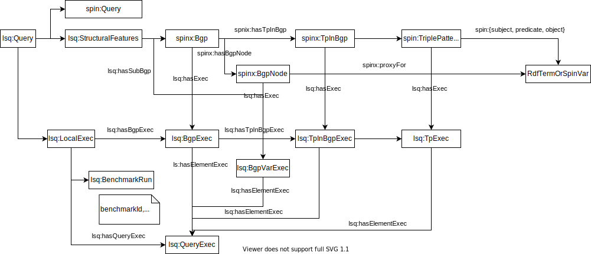

## Working with streams of named graphs

* From the command line: Our [sparql-integrate](https://github.com/SmartDataAnalytics/Sparqlintegrate) project ships with the "named graph stream" (ngs) tool. The deduplication of RDFized web logs depends on NGS.
* * If you like the tool but miss packaging for your system, please consider contributing one :)
* From Apache Spark: We are working on components that would enable an implementation of NGS running on Apache Spark. However, there is no estimate on that yet.




## New features in LSQ2

* Java API to access the generated RDF
* Automatic log format probing
* Support for costumizable prefix sources
* Greatly simplified log rdfization
* Greatly improved scalability on query deduplication
* Consolidated command line interface tool
* Query strings are now hashed using sha256 with base64url encoding. LSQ1 only used the first 8 hex chars of MD5 because of shorter and nicer looking IRIs but that caused a noticable number of clashes.

### RDFizing SPARQL Endpoint Log Files
RDFization converts each record of a log into a query centric named graph:

```
<http://ex.org/q-queryhash> {
  <http://ex.org/q-queryhash>
    hasRemoteExec <http://ex.org/re-endpointhash-hosthash_2020-01-01T01:01:01Z>
    lsq:asText "SELECT * ..."
    .
  
  <http://ex.org/re-endpointhash-hosthash_2020-01-01T01:01:01Z>
    lsq:endpoint "http://dbpedia.org/sparql" ;
    lsq:hostHash "hostHash" ; # Hashed IP; by default every invocation of lsq uses as fresh UUID as salt for privacy
    prov:atTime "2020-01-01_01:01:01" ;
    .
}
```


The only mandatory option for RDFization of log files is to provide a URL of the service the log is associated with:
```
rdfize -e "http://dbpedia.org/sparql" access.2020-01-01.log
```


### Benchmarking queries
Conceptually, setting up a benchmark requires the following three simple steps:

* Create a benchmark configuration
* Create a benchmark run
* Start or continue a benchmark run


Benchmark configurations and runs are small RDF documents. The LSQ tool provides intuitive commands that make it particularly easy to set them up.
The benchmark configuration contains the URL of the endpoint used for benchmarking and static information, such as the number of triples in the endpoint. A configuration also includes a timestamp for when it was created. If the number of triples changed it is recommended to create a new configuration.


An LSQ benchmark run is an experiment that yields observations.
The identity of an experiment is defined by three attributes
* an Id of the agent that launches it
* a distribution of a dataset through a SPARQL endpoint data service
* a time at which it was started

```
lsq benchmark create -d datasetId -e endpointUrl -g defaultGraph

```

Notably, there are two modes for observation resources:
* Append a suffix to the query resource - e.g. `http://lsq.aksw.org/q-123_xc_dbpedia_2020-01-01_at-2020-02-02`
* Standalone resources `http://my-experiment/xc-dbpedia_2020-01-01_at-2020-02-02`

```
lsq benchmark run --config config.ttl logs*
```


Preparing a benchmark run
```
lsq benchmark prepare-run --config config.ttl > benchmark-run.ttl
```

Continuing a benchmark run

```
lsq benchmark run --config benchmark-run.ttl logs* > benchmark-run.ttl
```


Execution of a benchmark of SPARQL queries has to run against a concrete distribution of a dataset in a SPARQL service.
The DCAT2 data model supports descriptions of just that.

* Why not provide the endpointURL to LSQ directly and later link it to a distribution ID?
For benchmarking, you will most likely use an endpoint URL such as `http://localhost:1234/sparql`. You may even start multiple instances of the
endpoint under the same URL - fixing this retroactively is just painful, so avoid it.


* The recommended approach is to create a small RDF snippet as follows. `lsq dist-template` helps with that.
```
#cat.ttl

@prefix eg: <http://www.example.org/>

eg:yourDataset # <-- ID of your dataset
  dcat:distribution yourDownloadableDistribution, eg:yourSparqlEndpointDistribution .


# vvv Valuable ID! vvv
eg:yourDatasetInYourEndpoint # <-- The techical manifestation of your dataset
  dcat:endpointURL <http://foo.bar/sparql> ;
  dcatx:defaultGraphs (<http://dbpedia.org) ;
  .
```

Why is the ID of the distribution valuable? Because it is linked to both an ID of the dataset so we know what is being queried,
as well as the concrete endpoint the benchmark system can connect to. This allows you to run

```
lsq benchmark --catalog cat.ttl --distribution eg:yourDatasetInYourEndpoint querylog.trig
```
Now lsq can connect to the provided endpoint as well as link the generated benchmarks to the given dataset identifier.
The dataset identifier has a greater chance of remaining stable than thet benchmark endpoint which typically will be discarded at some point.


* If you have a rather stable URL for the data and want a 'lazy' approach to assign IDs for datasets and distributions, consider using these '#' suffixes:

* `http://foo.bar/sparql#service`      - The data service 
* `http://foo.bar/sparql#dataset`      - The content of the dataset as hosted at this service, may be distributed elsewhere in addition
* `http://foo.bar/sparql#distribution` - The distribution of the dataset using this concrete service
* `http://foo.bar/sparql#content`      - The identify of DCAT2 datasets includes the publishing authority. The content is the just the data without the data. All RDF content that is isomporhic to each other is equivalent by definition.


## A-priori deduplication of queries


