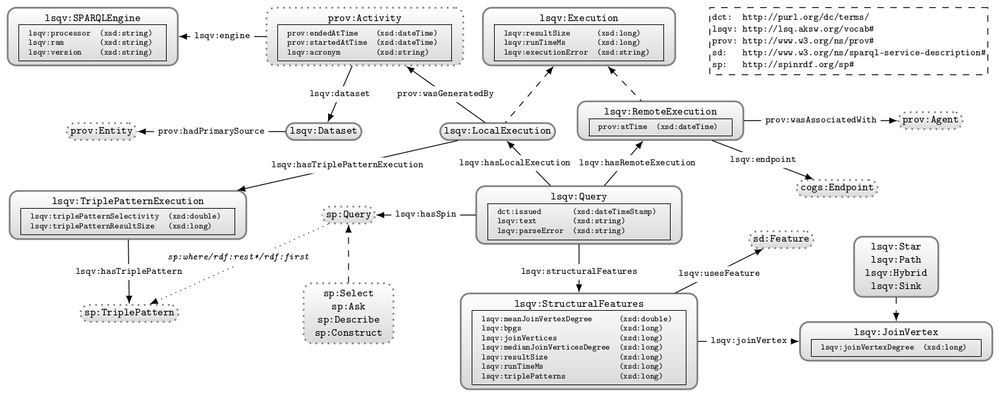

# The Linked SPARQL Queries (LSQ) Framework
LSQ is a framework for RDFizing arbitrary SPARQL query logs with support for several types of analysis.
This project page describes the framework; information about the Linked Dataset, a SPARQL endpoint, and complete dumps are all available on the LSQ [homepage](http://dice-group.github.io/LSQ/) along with pointers a VoID description, example LSQ queries, and various other dataset assets.


## Architecture
LSQ's architecture is based on a classic batch processing one.

* An item reader reads each entry of the input log file, normalizes the data by converting it to an RDF representation (based on the log format)
* An item processor performs the analysis steps according to the provided configuration.
* An output writer serializes each target resource to a file or STDOUT.

### Supported Analysis Types
* Structural features: This comprises metrics directly from a SPARQL query, such as the number of triple patterns, BGPs, projection variables.
* Executions analysis measures aspects of a query and its parts, such as BGPs and TPs, in regard to a dataset hosted in an RDF store. These aspects are:
 * Performance analysis
 * Result set sizes and selectivity

Executions can be marked as local and remote: a remote execution of a query takes place at the SPARQL endpoint whose log file contained the query, whereas a local execution take place on a 'local' instance of that RDF store setup.


### Supported log formats

#### Web log formats
Default log formats are configured in the [default-log-formats.ttl](lsq-core/src/main/resources/default-log-formats.ttl) file, which contains entries such as:
```rdf
fmt:combined
  a lsq:WebAccessLogFormat ;
  lsq:pattern "%h %l %u %t \"%r\" %>s %b \"%{Referer}i\" \"%{User-agent}i\"" ;
.
```
At present, LSQ performs lookup of patterns by their local name, such as _combined_ in this example.

The pattern definitions follow the specification of Apache's [mod_log_config](http://httpd.apache.org/docs/current/mod/mod_log_config.html).
Custom log formats can thus be easily added by simply extending the underlying RDF model.


##### Notes

* The timestamp pattern `%{...}t` only matches timestamps that are enclosed in `[brackets]`
  * `%{yyyy-MM-dd HH:mm:ss}C` can be used to parse timestamps from e.g. tab-separated files, such as `<TAB>2017-06-12 00:00:00<TAB>`.
    Note, that %C is so far not otherwise defined in the apache mod_log formats.

#### RDF-based formats
The LSQ tool can also RDFize queries from RDF datasets

*TODO* Finish this section
```bash
curl -GLH 'Accept: text/plain' http://lsq.aksw.org/sparql --data-urlencode query='PREFIX lsq: <http://lsq.aksw.org/vocab#> CONSTRUCT WHERE { ?s lsq:text ?o } LIMIT 10' | lsq -m rdf ...
```

```bash
cat unsorted-files/sparqlqc-all.nt | lsq -e http://localhost:8890/sparql -m rdf -l sparqlqc -p http://localhost/sparqlqc/sparql -r q > unsorted-files/sparqlqc-all-lsq.ttl
```

Notes:

* `-u`: Do not reuse the subject of the input triple for the output; i.e. given an input triple <s> <p> <o>, the output will *not* be attached to <s>, rather a new resource will be allocated.
* `-m rdf`: rdf is a currently hard-coded pseudo-log format (i.e. not configurable via the default log formats mentioned above).


## Vocabulary



## Java API

## The command line client (CLI)

#### Building the CLI Jar
Build the whole project with

```
mvn clean install
```

Build the command line client with
```bash
cd lsq-cli
mvn assembly:assembly
```

A self-contained jar is then located under lsq-cli/target/lsq-cli-{version}-jar-with-dependencies.jar
You can run it with

```bash
java -cp `find . -name 'lsq*jar-with-dependencies.jar'` org.aksw.simba.lsq.cli.main.MainLSQ
```

```bash
alias lsq='java -cp `find "/path/to/lsq-cli/target/" -name "lsq*jar-with-dependencies.jar"` org.aksw.simba.lsq.cli.main.MainLSQ'
```


#### Building the CLI debian package
This happends when you build the project (under lsq-debian-cli/target)
You can conveniently install it with

```bash
sudo dpkg -i `find . -name '*.deb'`
```


## Example usage

The following options exist:
```bash

Non-option arguments:                    
[String] -- File(s) containing input data

Option                       Description                                        
------                       -----------                                        
-a, --agent <String>         Http user agent field (default: Linked Sparql      
                               Queries (LSQ) client. User agent not set.)       
-b, --base <String>          Base URI for URI generation (default: http://lsq.  
                               aksw.org/res/)                                   
-d, --dsize <Long>           Dataset size. Used in some computations. If not    
                               given, it will be queried (which might fail).    
                               Negative values disable dependent computations.  
-e, --endpoint <String>      Local SPARQL service (endpoint) URL on which to    
                               execute queries (default: http://localhost:      
                               8890/sparql)                                     
--fed <String>               URIs of federated endpoints                        
--fedf <File>                URIs of federated endpoints                        
-g, --graph <String>         Local graph(s) from which to retrieve the data     
-h, --head <Long>            Only process n entries starting from the top       
-i, --logirisasbase          Use IRIs in RDF query logs as the base IRIs        
-l, --label <String>         Label of the dataset, such as 'dbpedia' or 'lgd'.  
                               Will be used in URI generation (default: mydata) 
-m, --format [String]        Format of the input data. Available options:       
                               [commonVHost, virtuoso, common, rdf,             
                               distributed, commonVirtuoso, combined, sparql,   
                               wikidata, sparql2, bio2rdf] (default: combined)  
-o, --output <File>          File where to store the output data.               
-p, --public <String>        Public endpoint URL for record purposes - e.g.     
                               http://dbpedia.org/sparql                        
-q, --querypattern [String]  Pattern to parse out query ids; use empty string   
                               to use whole IRI (default: q-([^->]+))           
-r, --rdfizer [String]       RDFizer selection: Any combination of the letters  
                               (e)xecution, (l)og, (q)uery and (p)rocess        
                               metadata (default: elq)                          
-t, --timeout <Long>         Timeout in milliseconds                            
-w, --outformat <String>     Format for (w)riting out data. Available options:  
                               [JSON-LD/expand pretty, JSON-LD/frame flat,      
                               RDF/JSON, TriG/pretty, JSON-LD/flatten flat, N-  
                               Quads/ascii, RDF/XML/pretty, JSON-LD/expand      
                               flat, RDF-THRIFT/Value, Turtle/blocks, N-        
                               Triples/ascii, rdf/null, TriX, Turtle/flat, JSON-
                               LD/compact flat, JSON-LD/flatten pretty, RDF-    
                               THRIFT, N-Quads/utf-8, JSON-LD/compact pretty,   
                               TriG/flat, JSON-LD/frame pretty, RDF/XML/plain,  
                               N-Triples/utf-8, Turtle/pretty, TriG/blocks]     
                               (default: Turtle/blocks)                         
-x, --experiment <String>    URI of the experiment environment                  
-y, --delay <Long>           Delay in milliseconds (default: 0)                 
```

From the repository root folder, run:

```bash
lsq \
  lsq-core/src/test/resources/swdf.apache.log \
  -e http://localhost:8890/sparql \
  -g http://aksw.org/benchmark \
  -l swdf \
  -b http://lsq.aksw.org/res/ \
  -p http://data.semanticweb.org/sparql \
  -h 10 \
  -r qel \
  -t 60000 \
  -o outfile.ttl
```

```bash
lsq \
  lsq-core/src/test/resources/dbpedia.virtuoso.log \
  -m virtuoso \
  -e http://localhost:8890/sparql \
  -g http://aksw.org/benchmark \
  -l swdf \
  -b http://lsq.aksw.org/res/ \
  -p http://data.semanticweb.org/sparql \
  -h 10 \
  -t 60000 \
  -r qel | rapper -i turtle -o ntriples - http://foo | sort -u > a.ttl
```


